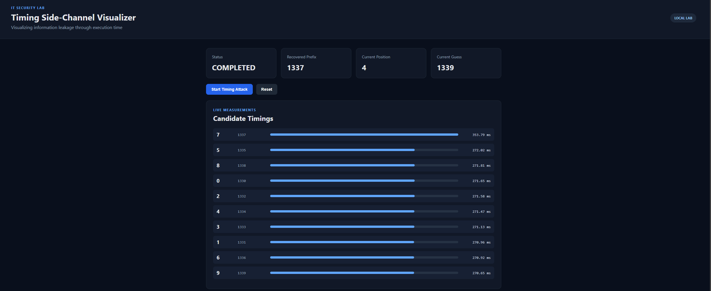

# Timing Side-Channel Visualizer

A local educational security project that visualizes how execution time can leak information about a secret PIN.


---

## Overview

The vulnerable validator compares a guessed PIN with the correct PIN digit by digit.

For every correct digit, the validator takes slightly longer to respond.

The attack measures this execution time and uses the timing differences to recover the PIN one digit at a time.

```text
Guess PIN
   |
   v
Vulnerable Validator
   |
   v
Execution Time
   |
   v
Timing Analysis
   |
   v
Recovered PIN
```

---

## Features

- Local timing side-channel demonstration
- Four-digit PIN recovery
- Multiple timing measurements per candidate
- Median-based timing analysis
- Live Flask REST API
- Live timing visualization
- Recovery progress display
- Local intentionally vulnerable validator
- Educational and isolated security lab

---

## Technologies

- Python
- Flask
- subprocess
- timing measurements
- threading
- HTML
- CSS
- JavaScript
- Fetch API
- Git / GitHub

---

## Project Structure

```text
timing-side-channel-visualizer/
│
├── attack/
│   ├── demo_validator.py
│   └── timing_attack.py
│
├── backend/
│   └── app.py
│
├── dashboard/
│   ├── index.html
│   ├── style.css
│   └── app.js
│
├── .gitignore
├── requirements.txt
└── README.md
```

---

## Installation

Create a virtual environment:

```powershell
python -m venv .venv
```

Activate it on Windows:

```powershell
.\.venv\Scripts\Activate.ps1
```

Install dependencies:

```powershell
python -m pip install -r requirements.txt
```

---

## Running

Start the application:

```powershell
python backend/app.py
```

Open:

```text
http://127.0.0.1:8000
```

Click:

```text
Start Timing Attack
```

The dashboard will display the timing measurements and recover the PIN step by step.

---

## Live Dashboard

The dashboard visualizes the timing side-channel attack in real time.

### Timing Analysis



This view shows the measured execution times for the tested PIN candidates.

Longer execution times indicate that more leading digits of the PIN are correct, which allows the attack to recover the PIN step by step.

### Recovered PIN


This view shows the final stage of the attack after all four PIN digits have been identified.

The dashboard displays the recovered prefix, the completed PIN and the measurement results used during the attack.

---

## Security Concept

A timing side channel occurs when the execution time of a program depends on secret information.

In this demo, the validator returns immediately after finding the first incorrect digit.

This means that a guess with a longer matching prefix takes longer to process.

```text
0000 -> very short
1000 -> longer
1300 -> even longer
1330 -> longer again
1337 -> full match
```

The attacker can therefore infer the secret PIN from timing differences.

---

## Background

The original university task required implementing a Python timing side-channel attack against a provided vulnerable PIN validation program.

The original provided validator is not included in this repository.

For this portfolio version, a separate intentionally vulnerable local demo validator was implemented so that the project can be executed independently.

The portfolio extension also adds:

- Flask backend
- REST API
- Live web dashboard
- Timing visualization
- Recovery progress monitoring
- Improved project structure and documentation

---

## Disclaimer

This project is intended only for local educational use and demonstrates a deliberately introduced vulnerability in the included demo validator.

---

## Author

Khaled Khazah

Computer Science Student  
University of Osnabrück